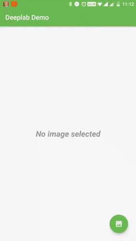

# DeepLab on Android (TFLite with GPU)
DeepLab is a state-of-art deep learning model for semantic image segmentation, where the goal is to assign semantic labels (e.g., person, dog, cat and so on) to every pixel in the input image. Here is the mobile version running on Android devices.

## Latest updates
Tensorflow Lite announced a preview version with GPU support, you can read [TensorFlow Lite GPU Delegate Tutorial](https://www.tensorflow.org/lite/performance/gpu) for further information.

Along with this preview release, it also published a set of pre-trained models for testing the performance. These models include a DeepLab TFLite model.

Due to Tensorflow mobile is deprecated. The latest code of this repository will use Tensorflow Lite instead of Tensorflow Mobile. The following parts of this document will explain a bit more about this new Tensorflow Lite version. Tensorflow Mobile related content is archived [here](doc/README_OLD.md).

## Downloading the TFlite model

According to the [TensorFlow Lite GPU Delegate Tutorial](https://www.tensorflow.org/lite/performance/gpu), with the release of the GPU delegate, they included a handful of models that can be run on the backend. You can download the DeepLab segmentation model which supports 257 x 257 inputs.

Here is a download shortcut:
[DeepLab segmentation (257x257)](https://storage.googleapis.com/download.tensorflow.org/models/tflite/gpu/deeplabv3_257_mv_gpu.tflite)

Don't worry, if you cannot download the original one from the link above, I have already included on the source codes. It is placed under directory [app/src/main/assets/](app/src/main/assets/).

## Running the demo

Compare to the Tensorflow Mobile version, the TFLite model has a smaller size. TF Mobile model is about 8.4 MB, while the Lite version is only 2.4 MB. I include the model inside apk, so running the demo becomes much easier than before. Import the source codes to your Android Studio IDE, and Run. You will see the demo. Here is a short video for the demo.


## A bit more about codes
To be compatible with original codes with Tensorflow Mobile, I have refactored the codes.
I created a delegate named [DeeplabModel](app/src/main/java/com/dailystudio/deeplab/ml/DeeplabModel.java), which provides implementation both for Tensorflow Lite and Tensorflow Mobile.
```java
public class DeeplabModel {

    private final static Boolean USE_TF_LITE = true;

    private static DeeplabInterface sInterface = null;

    public synchronized static DeeplabInterface getInstance() {
        if (sInterface != null) {
            return sInterface;
        }

        if (USE_TF_LITE) {
            sInterface = new DeepLabLite();
        } else {
            sInterface = new DeeplabMobile();
        }

        return sInterface;
    }

}
```
> Changing the value of static variable **USE_TF_LITE** can easily switch the implementation between Tensorflow Lite and Tensorflow Mobile.

[DeeplabInterface](app/src/main/java/com/dailystudio/deeplab/ml/DeeplabInterface.java)  provides unified interfaces of the DeepLab model which can smoothly be integrated with the high-level application with any exposure of low-level implementation details.


```java
public interface DeeplabInterface {

    boolean initialize(Context context);

    boolean isInitialized();

    int getInputSize();

    Bitmap segment(Bitmap bitmap);

}
```
[DeeplabMobile](app/src/main/java/com/dailystudio/deeplab/ml/DeeplabMobile.java) and  [DeeplabLite](app/src/main/java/com/dailystudio/deeplab/ml/DeeplabLite.java) are two diversities of [DeeplabInterface](app/src/main/java/com/dailystudio/deeplab/ml/DeeplabInterface.java) implementation, which base on Tensorflow Mobile and Tensorflow Lite accordingly.
- [DeeplabMobile](app/src/main/java/com/dailystudio/deeplab/ml/DeeplabMobile.java) is an implementation with Tensorflow Mobile (deprecated), for more details, please refer to old README documentation [here](doc/README_OLD.md).
- [DeeplabLite](app/src/main/java/com/dailystudio/deeplab/ml/DeeplabLite.java) is an implementation with GPU preview version of Tensorflow Lite. The implementation will use GPU as default.
```java
    Interpreter.Options options = new Interpreter.Options();

    if (USE_GPU) {
        GpuDelegate delegate = new GpuDelegate();
        options.addDelegate(delegate);
    }

    Interpreter interpreter = new Interpreter(mModelBuffer, options);
```
> Changing the value of static variable **USE_GPU** can enable or disable GPU support in Tensorflow Lite.

## Issues
Currently, the GPU preview version of Tensorflow Lite has an issue that creating Interpreter and calling interpreter.run() should happen in the same thread. Otherwise, it will be blocked the thread. Here is an issue to tracking this problem:
https://github.com/tensorflow/tensorflow/issues/25657

## Performance
Here is a quick performance analysis of DeepLab models on several devices.
- **TF Mobile model** with 513 x 513 inputs
- **TF Lite model** with 257 x 257 inputs

It is tested with the same 10 pictures. The result is an average of the time elapses during **interpreter.run()** calling.

Tests (in ms.)        | OnePlus 3T   | OnePlus 5 | Pixel 2 XL
:------               | :------      | :------   | :------
TF Mobile             | 1096 ms      | 1166 ms   | 1237 ms
TF Lite (disable GPU) | 173 ms       | 172 ms    | 124 ms
TF Lite (enable GPU)  | 137 ms       | 133 ms    | 138 ms

And, here are the segmented results.

Original    | TF Mobile | TF Lite
:-------    | :-------  | :-------
 |  | 
 |  | 

## Issues
Currently, the GPU preview version of Tensorflow Lite has an issue that creating Interpreter and calling interpreter.run() should happen in the same thread. Otherwise, it will be blocked the thread.
Here is an issue to tracking this problem:
https://github.com/tensorflow/tensorflow/issues/25657

## License

[Apache License 2.0](LICENSE)

## Attributions/Thanks
- DeepLabv3+:
```
@article{deeplabv3plus2018,
  title={Encoder-Decoder with Atrous Separable Convolution for Semantic Image Segmentation},
  author={Liang-Chieh Chen and Yukun Zhu and George Papandreou and Florian Schroff and Hartwig Adam},
  journal={arXiv:1802.02611},
  year={2018}
}
```

- MobileNetv2:

```
@inproceedings{mobilenetv22018,
  title={Inverted Residuals and Linear Bottlenecks: Mobile Networks for Classification, Detection and Segmentation},
  author={Mark Sandler and Andrew Howard and Menglong Zhu and Andrey Zhmoginov and Liang-Chieh Chen},
  booktitle={CVPR},
  year={2018}
}
```
- Without the advice given by [Liang-Chieh Chen](https://github.com/aquariusjay), we cannot successfully export the model on mobile devices.